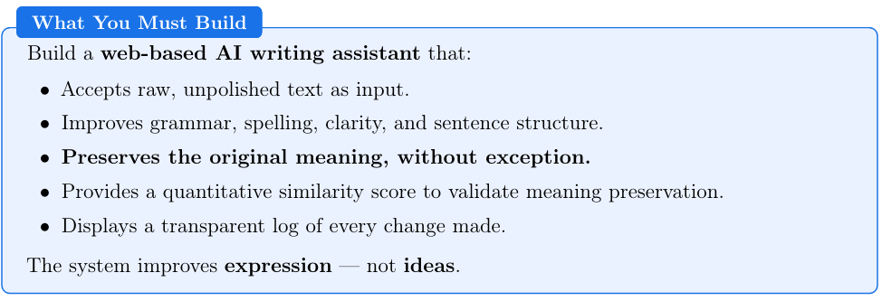
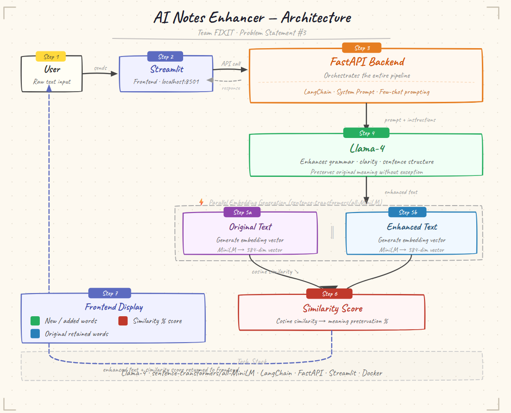
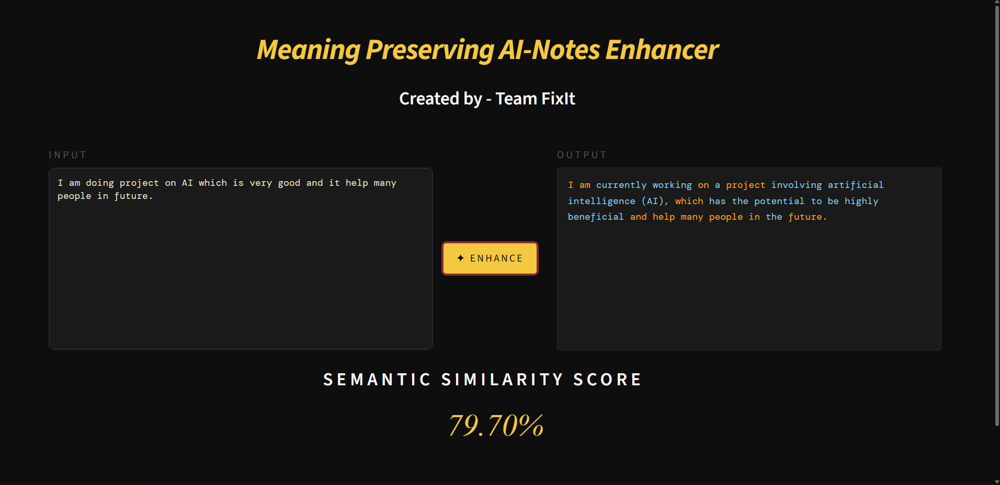

# Meaning Preserving AI-Notes Enhancer

> **Team FIXIT** — Problem Statement No. 3
## Problem Statement


---

## Agent Name
**Meaning Preserving AI-Notes Enhancer**
An AI writing assistant that improves grammar, spelling, clarity, and sentence structure while preserving the original meaning — validated by a quantitative similarity score.

---

## Agent Address
**Repository:** [https://github.com/pankaj-2708/Neural-Style-Transfer](https://github.com/pankaj-2708/Neural-Style-Transfer)
**Frontend (AWS) :** http://13.63.94.119:8501/

---

## Framework Used

| Component | Technology |
|-----------|-----------|
| LLM Orchestration | LangChain |
| Language Model | Llama-4 (text enhancement) |
| Embedding Model | sentence-transformers/all-MiniLM (similarity scoring) |
| Backend API | FastAPI |
| Frontend | Streamlit |
| Containerization | Docker |
| AWS | hosting |

---

## Architecture Explanation

The system follows a client-server architecture with the following flow:

1. **User Input** — The user enters raw, unpolished text into the Streamlit web app.
2. **Backend Processing** — The raw text is sent to the FastAPI backend, which forwards it to **Llama-4** using a system instruction and few-shot prompting to produce enhanced text.
3. **Parallel Embedding Generation** — Embeddings for both the original and enhanced text are generated in parallel using `sentence-transformers/all-MiniLM`.
4. **Similarity Scoring** — Cosine similarity is computed between the two embeddings to produce a meaning-preservation score.
5. **Response** — The backend returns the enhanced text and similarity score to the frontend.
6. **Visual Display** — The frontend highlights newly added words in **sky-blue** and retained original words in **orange**, alongside the similarity score.


---
## Architecture Diagram
</img>

---

## Demo Screeen-Shot

</img>

---

## Setup Instructions

### Prerequisites
- Python 3.8+
- Git

### Step 1 — Clone the Repository
```bash
git clone https://github.com/pankaj-2708/Neural-Style-Transfer.git
```

### Step 2 — Create and Activate a Virtual Environment
```bash
python -m venv gdg
gdg\Scripts\Activate       
```

### Step 3 — Install Backend Dependencies
```bash
cd ./Webapp/Backend
pip install -r requirements.txt
```

### Step 4 — Start the Backend
```bash
python main.py
```

### Step 5 — Install Frontend Dependencies
```bash
cd ../Frontend
pip install -r requirements.txt
```

### Step 6 — Start the Frontend
```bash
streamlit run app.py
```

The app will be accessible at **http://localhost:8501/**

---

## Additional Resources

- [LangChain Documentation](https://docs.langchain.com/)
- [FastAPI Documentation](https://fastapi.tiangolo.com/)
- [Streamlit Documentation](https://docs.streamlit.io/)
- [sentence-transformers Documentation](https://www.sbert.net/)
- [Meta Llama-4 on Hugging Face](https://huggingface.co/meta-llama)
- [Docker Documentation](https://docs.docker.com/)